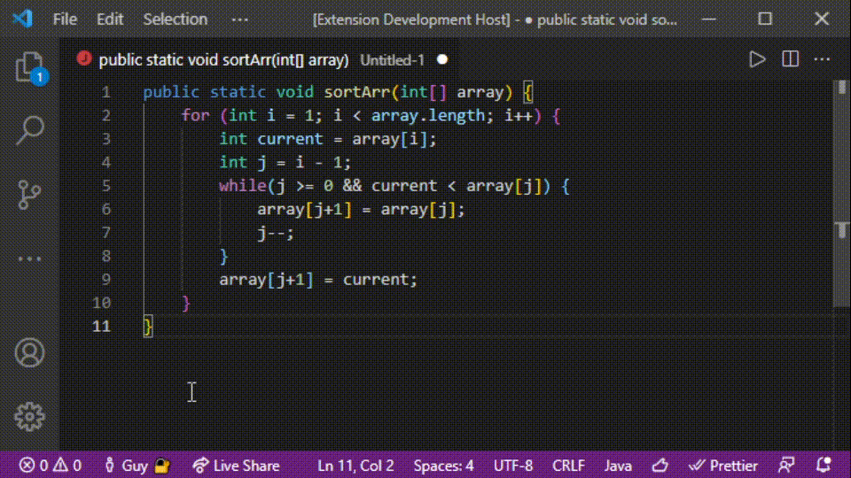

# vsgencomments README

This extension interfaces with a server-based AI model that returns a text comment describing a function
passed to the model as a parameter.
\
&nbsp;

## Features

- Currently produces one function level comment for a singly selected Java function per execution

- Presents the user with an in-text preview with a continue/cancel prompt

> Use the keyboard combination of &nbsp;`CTRL + ALT + ;` to generate the comment

&nbsp;

&nbsp;

## Requirements

Please refer to the [following](https://github.com/Nathan-Nesbitt/CodeSummary) README, in order to properly configure the model prior to using the extension.

Please have Node.js installed, you can check out the documentation [here](https://nodejs.org/en/)

Please have Python installed, you can check out the documentation [here](https://www.python.org/downloads/)
&nbsp;

## Development Environment

1. Clone repository
2. Make sure to follow the #[Requirements](#requirements) section to properly run the server to load in the lamner model
3. Run npm install to get all of the needed dependencies
4. Open up a terminal instance in VSCode, and type in `npm run watch`
5. Hit `F5` to go into debug mode
6. Select your desired function, and run the extension command
\
&nbsp;

## Extension Settings, Commands

This extension contributes the following palette commands:

- 'vsgencomments.insertComment': executes the model using the currently selected text
\
&nbsp;

## Known Issues

No known issues to date
\
&nbsp;

## Release Notes

### 0.0.1

Initial development release of VSGencomments
